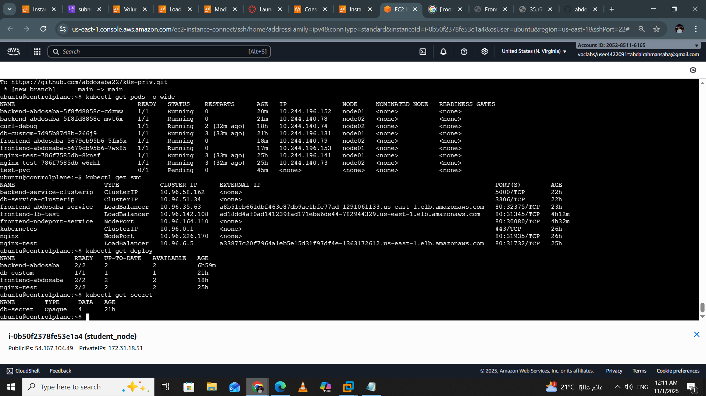
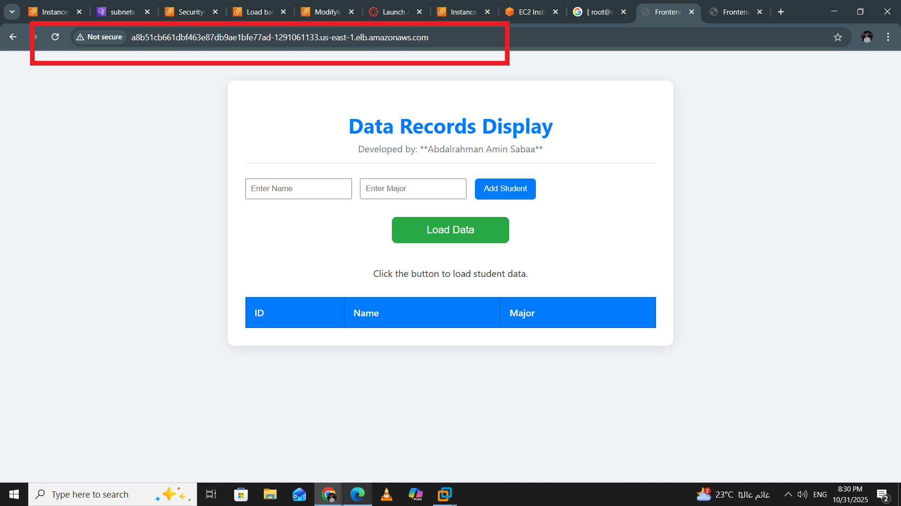
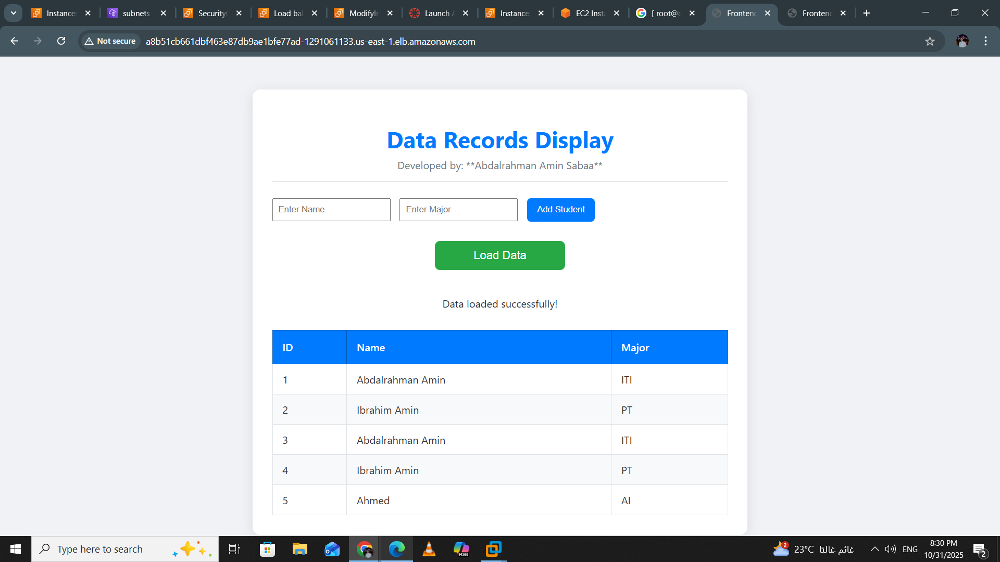
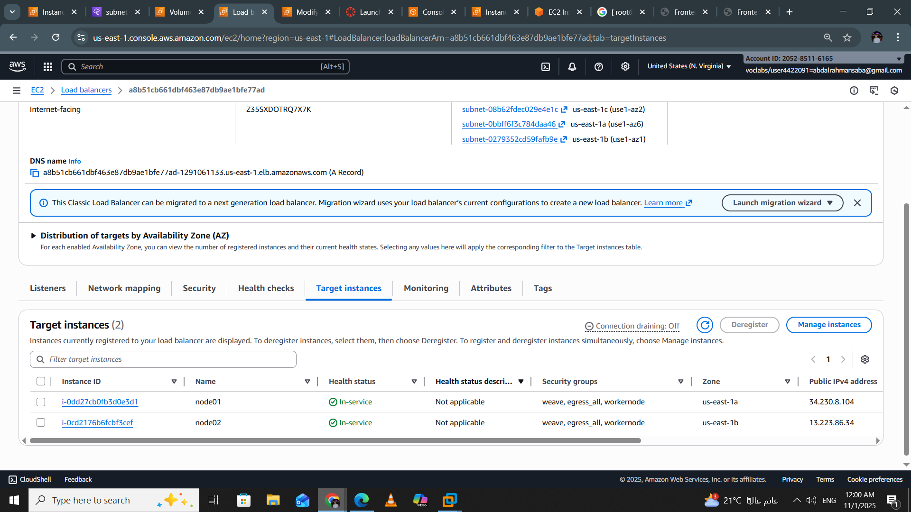

# 🐳 Docker & Kubernetes 3-Tier Student Data Application

## 📘 Description

This project demonstrates a fully containerized **3-Tier Application** built with **Docker**, and now extended to support **Kubernetes (K8s)** for cloud-native orchestration. It showcases best practices for **isolation**, **security**, and **internal communication** between services.

> 🔔 **New in this version:**  
> - Added Kubernetes manifests for deploying the same 3-tier architecture on a K8s cluster  
> - Tested on AWS EC2 instances with multi-node setup  
> - Includes PersistentVolume setup using AWS EBS and HostPath for local testing

| Layer | Technology | Container | Description |
|:------|:------------|:-----------|:-------------|
| **Frontend** | Apache HTTPD | `frontend_service` | Serves static HTML files and acts as a **Reverse Proxy** to the backend. |
| **Backend** | Python / Flask | `backend_service` | Provides an API endpoint (`/get-records`) and communicates with the database. |
| **Database** | MariaDB | `database_service` | Stores student data and initializes automatically at startup. |

---

## 🚀 Getting Started

### ✅ Prerequisites

Make sure the following are installed:

- **Docker Desktop** (or Docker Engine)  
- **Docker Compose** (usually included with Docker Desktop)

---

### ⚙️ How to Run

From the root of the project (where the `docker-compose.yml` file exists), run:

```bash
docker-compose up --build -d
````

**Explanation:**

* `up` → Creates and starts all containers
* `--build` → Rebuilds images if dependencies have changed
* `-d` → Runs containers in detached mode

---

## 🌐 Accessing the Application

After all containers start (wait ~10 seconds for the database initialization):

| Feature                     | URL                                                                | Description                                                                     |
| :-------------------------- | :----------------------------------------------------------------- | :------------------------------------------------------------------------------ |
| **Full Application**        | [http://localhost:8080/](http://localhost:8080/)                   | Displays student records fetched from the backend through Apache Reverse Proxy. |
| **Proxy Test**              | [http://localhost:8080/test-api/](http://localhost:8080/test-api/) | Displays `Hello, Docker! Backend is UP.` confirming the proxy works.            |
| **Backend Isolation Check** | [http://localhost:5000/](http://localhost:5000/)                   | Should fail (backend not exposed to host).                                      |

---
# Application Screenshot

Here is a view of the working application:


Here is how data returned from backend to frontend in json frormat 


---

## ☸️ Kubernetes Extension

The project now includes Kubernetes manifests to deploy the same architecture on a real cluster.

| Component     | Resource Type        | Notes |
|---------------|----------------------|-------|
| **Frontend**  | Deployment + Service | Exposed via LoadBalancer |
| **Backend**   | Deployment + Service | Internal ClusterIP |
| **Database**  | Deployment + PVC     | Uses Local storage |
| **Secrets**   | Kubernetes Secret    | Injected into backend and DB |
| **Init Script** | ConfigMap          | Used to initialize DB schema |


> All manifests are located in the `k8s/` folder.

To deploy on Kubernetes:

```bash
kubectl apply -f k8s/
```markdown

---

### Application Screens

---

## 📸 AWS Deployment Screenshots

Here are screenshots from the live deployment on AWS:

| Screenshot | Description |
|------------|-------------|
|  | Kubernetes Dashboard showing Cluster |
|  | Access App using aws LoadBalancer |
|  |  Access App using aws LoadBalancer |
|  | aws Load balancer |

> All screenshots are stored in the `Pics/` folder.


## 🧱 Project Structure

```bash
.
├── Docker/                     # 🐳 Docker-based deployment
│   ├── frontend/
│   ├── backend/
│   ├── database/
│   └── docker-compose.yml      # Main Docker orchestration file
│
├── K8S/                        # ☸️ Kubernetes-based deployment
│   ├── 1-Frontend/               # Frontend Deployment + Service + Configs
│   ├── 2-Backend/                # Backend Deployment + Service + Secrets
│   ├── 3-db/                     # MariaDB Deployment + PVC + PV + ConfigMap
│   ├── 4-debugger/               # Debugging tools (e.g., curl pods, test configs)
│   └── 5-ccm/                    # Cluster Configuration Management (e.g., StorageClass, RBAC)
│
├── Pics/                       # 📸 Screenshots for whole project deployment
│   
└── README.md                   # Project documentation

```

---

## 🧰 Useful Commands

| Command                                 | Description                    |
| :-------------------------------------- | :----------------------------- |
| `docker ps`                             | List running containers        |
| `docker logs <container_name>`          | View container logs            |
| `docker exec -it <container_name> bash` | Access container shell         |
| `docker-compose down`                   | Stop and remove all containers |

---

## 💡 Notes

* The project showcases how to securely decouple application layers using **Docker networks**.
* The **Apache Reverse Proxy** pattern hides backend services and exposes only the frontend.
* Ideal for learning **Docker Networking**, **Reverse Proxying**, and **multi-container orchestration**.

---

📜 **License:**
This project is for **educational purposes** — feel free to modify and extend it.

```

