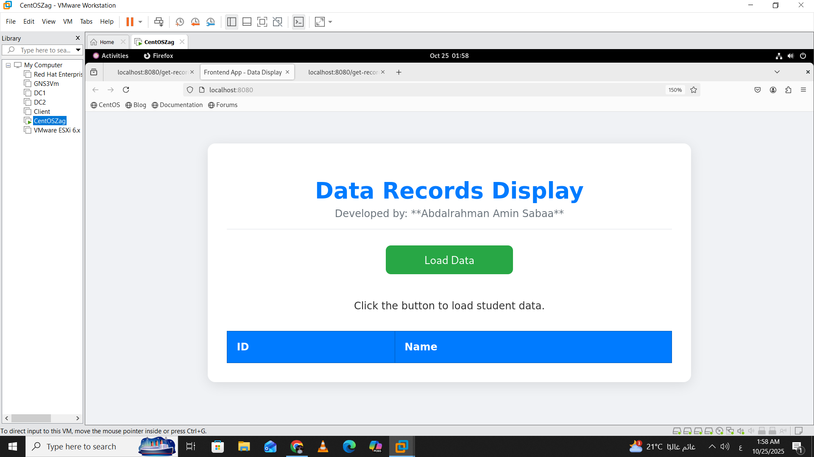
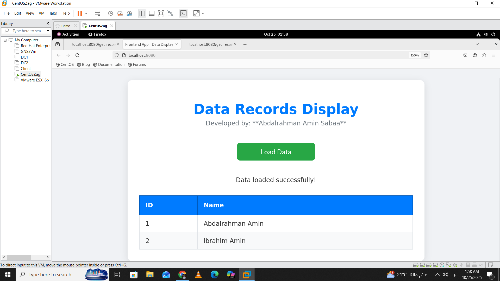
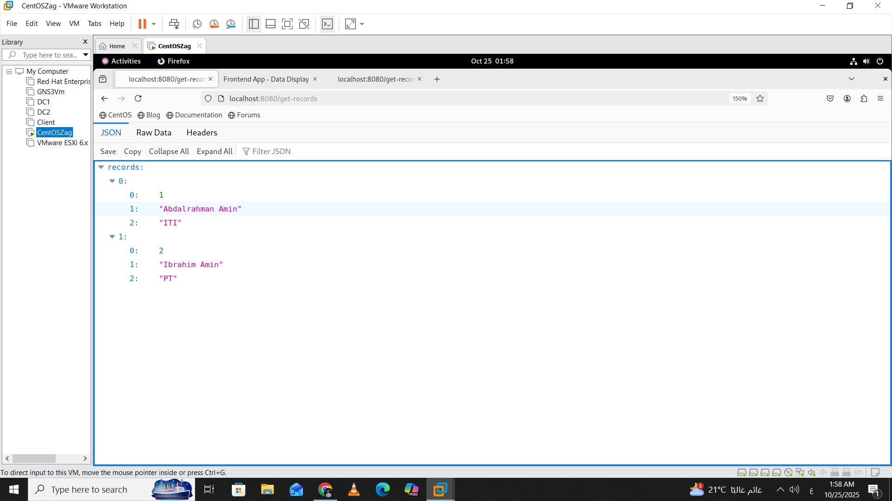

# 🐳 Docker 3-Tier Student Data Application

## 📘 Description

This project demonstrates a fully containerized **3-Tier Application** built with **Docker**, showcasing best practices for **isolation**, **security**, and **internal communication** between services.

| Layer | Technology | Container | Description |
|:------|:------------|:-----------|:-------------|
| **Frontend** | Apache HTTPD | `frontend_service` | Serves static HTML files and acts as a **Reverse Proxy** to the backend. |
| **Backend** | Python / Flask | `backend_service` | Provides an API endpoint (`/get-records`) and communicates with the database. |
| **Database** | MariaDB | `database_service` | Stores student data and initializes automatically at startup. |

---

## 🚀 Getting Started

### ✅ Prerequisites

Make sure the following are installed:

- **Docker Desktop** (or Docker Engine)  
- **Docker Compose** (usually included with Docker Desktop)

---

### ⚙️ How to Run

From the root of the project (where the `docker-compose.yml` file exists), run:

```bash
docker-compose up --build -d
````

**Explanation:**

* `up` → Creates and starts all containers
* `--build` → Rebuilds images if dependencies have changed
* `-d` → Runs containers in detached mode

---

## 🌐 Accessing the Application

After all containers start (wait ~10 seconds for the database initialization):

| Feature                     | URL                                                                | Description                                                                     |
| :-------------------------- | :----------------------------------------------------------------- | :------------------------------------------------------------------------------ |
| **Full Application**        | [http://localhost:8080/](http://localhost:8080/)                   | Displays student records fetched from the backend through Apache Reverse Proxy. |
| **Proxy Test**              | [http://localhost:8080/test-api/](http://localhost:8080/test-api/) | Displays `Hello, Docker! Backend is UP.` confirming the proxy works.            |
| **Backend Isolation Check** | [http://localhost:5000/](http://localhost:5000/)                   | Should fail (backend not exposed to host).                                      |

---
# Application Screenshot

Here is a view of the working application:





Here is how data returned from backend to frontend in json frormat 




---

## 🧱 Project Structure

```bash
.
├── frontend/
│   ├── proxy_modules.conf
│   ├── vhost.conf
│   ├── index.html
│   └── Dockerfile        
├── backend/
│   ├── app.py
│   ├── requirements.txt
│   ├── init_db.sql
│   └── Dockerfile        
├── database/
│   └── createtables.sql         
├── docker-compose.yml
└── README.md
```


---

## 🧰 Useful Commands

| Command                                 | Description                    |
| :-------------------------------------- | :----------------------------- |
| `docker ps`                             | List running containers        |
| `docker logs <container_name>`          | View container logs            |
| `docker exec -it <container_name> bash` | Access container shell         |
| `docker-compose down`                   | Stop and remove all containers |

---

## 💡 Notes

* The project showcases how to securely decouple application layers using **Docker networks**.
* The **Apache Reverse Proxy** pattern hides backend services and exposes only the frontend.
* Ideal for learning **Docker Networking**, **Reverse Proxying**, and **multi-container orchestration**.

---

📜 **License:**
This project is for **educational purposes** — feel free to modify and extend it.

```

